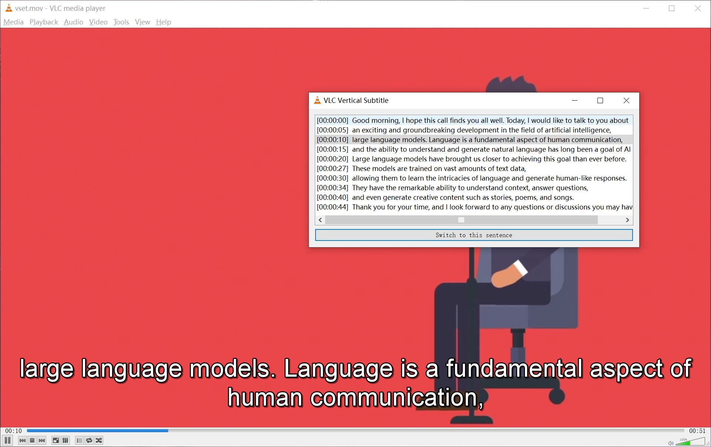

# vertical-subtitles-extension

This extension is designed for **VLC 2.0.8**. Once installed, it provides the ability to browse subtitles in a list and allows users to navigate to the corresponding video positions based on selected subtitles. Please note that it is not compatible with the latest versions of [VLC](https://www.videolan.org/vlc/), as the `add_callback` function has been [removed](https://forum.videolan.org/viewtopic.php?t=100885).

Now we have exceptional tools like [Whisper](https://github.com/openai/whisper) and [whisper.cpp](https://github.com/ggerganov/whisper.cpp) that make subtitle file generation remarkably simple. I developed this extension for browsing videos based on subtitles and loop playback of some segments.

## Installation

Only Windows 64-bit is tested. The installation steps are as follows:

Step 1: Download the [vlc-2.0.8-win64.zip](https://download.videolan.org/pub/videolan/vlc/2.0.8/win64/vlc-2.0.8-win64.zip) or compile it from [source](https://download.videolan.org/pub/videolan/vlc/2.0.8/vlc-2.0.8.tar.xz).

Step 2: Unzip vlc-2.0.8-win64.zip and create a subfolder named "extensions" in the lua folder. **Copy the file "vertical-subtitles-extension.lua" into the newly created subfolder ("extensions")**.

Alternatively, the compressed package available in the "releases" section can be used.

## Usage

Open the downloaded VLC player and open a video file with external subtitles (for example, if you have both demo.mp4 and demo.srt or demo.wav.srt in the same folder). Then, click on the "View" menu and select the "Vertical Subtitles Extension" submenu.

If the plugin is running correctly, you will see a dialog box with a list of subtitles. Select one or multiple lines, and then click the "Switch to this sentence" button. The video timeline will move to the selected first line.

Shortcuts are also available. Clicking the VLC main window to give it focus and then pressing the **"," key** (the first key to the right of the "M" key) is equivalent to clicking the "Switch to this sentence" button. Pressing the **"/" key** (the third key to the right of the "M" key) will check if the current timeline is within the selected subtitle interval. If it's not, it will move the timeline to the start of the interval. You can keep pressing this key to achieve looping playback of the selected segment.

## Known Issues

The extension may crash when the "/" key is pressed continuously.

Loading subtitle files may fail if there are spaces or non-English characters in the file path of the VLC folder or the video.

The keyboard shortcuts may not work if the input method is enabled.

## Screenshot

## License

This project is licensed under the MIT License - see the [LICENSE](LICENSE) file for details.
